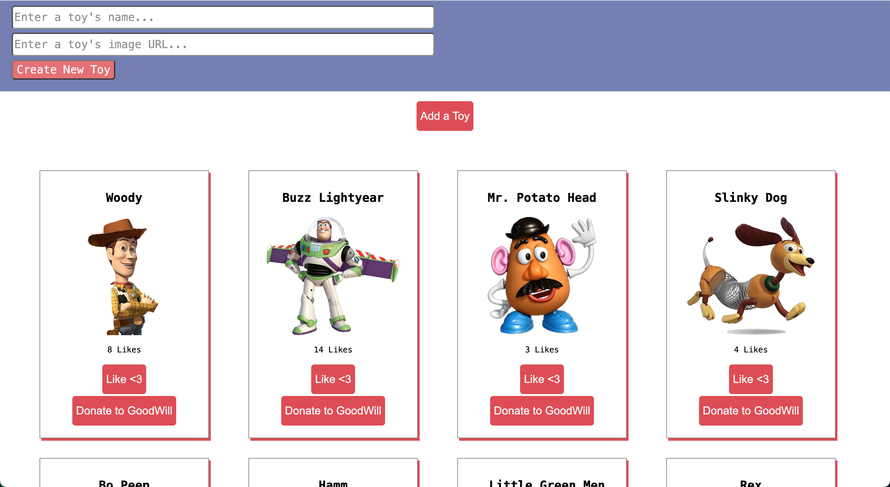

# Toy Tales

Toy Tales is a React CRUD application that allows users to manage Andy's toy collection.

## Features

- View all toys on page load
- Add a new toy using the form
- Like a toy and increase its likes
- Donate a toy and remove it from the list

## Technologies Used

- React
- Vite
- JSON Server
- JavaScript
- CSS

## Setup

Install dependencies:

```bash
npm install
```

Start the backend:

```bash
npm run server
```

Start the React application:

```bash
npm run dev
```

Run tests:

```bash
npm test
```

## CRUD Functionality

### GET
Fetches all toys from the backend and displays them on page load.

### POST
Creates a new toy and adds it to the page.

### PATCH
Updates the likes count when the Like button is clicked.

### DELETE
Removes a toy from the backend and the page when Donate is clicked.# Toy Tales

Toy Tales is a React CRUD application that allows users to manage Andy's toy collection. The application connects a React frontend to a JSON Server backend and demonstrates full CRUD (Create, Read, Update, Delete) functionality.

## Features

* View all toys on page load
* Add a new toy using the form
* Like a toy and increase its likes count
* Donate (delete) a toy from the collection
* Persist data using a JSON Server backend

## Technologies Used

* React
* Vite
* JavaScript (ES6+)
* JSON Server
* CSS

## Setup

### Install Dependencies

```bash
npm install
```

### Start the Backend Server

```bash
npm run server
```

The backend will run at:

```text
http://localhost:3001/toys
```

### Start the React Application

```bash
npm run dev
```

The application will run at:

```text
http://localhost:5173
```

### Run Tests

```bash
npm test
```

## CRUD Functionality

### GET - Display Toys

When the application loads, a GET request is sent to the backend to retrieve all toys. The toys are stored in state and rendered on the page.

### POST - Add a Toy

When the form is submitted, a POST request creates a new toy with an initial likes count of 0. The new toy is then added to state and displayed immediately.

### PATCH - Like a Toy

When the Like button is clicked, a PATCH request updates the toy's likes count on the backend. The updated likes count is then reflected in the UI.

### DELETE - Donate a Toy

When the Donate to GoodWill button is clicked, a DELETE request removes the toy from the backend and the toy card is removed from the page.

## Screenshot



